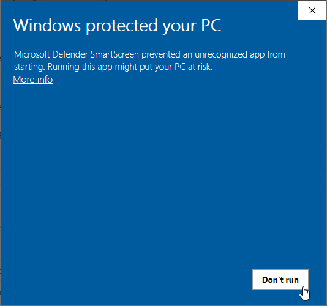

[](https://github.com/uroesch/DrawIOPortable/actions?query=workflow%3Abuild-package)
[](https://github.com/uroesch/DrawIOPortable/releases)
[](#runtime-dependencies)


# draw.io Portable for PortableApps.com


[draw.io Desktop](https://draw.io/) is designed to be 
completely isolated from the Internet. All JavaScript 
files are self-contained, the Content Security Policy 
forbids running remotely loaded JavaScript.

No diagram data is ever sent externally, nor do we send
any analytics about app usage externally. This means 
certain functionality for which we do not have a JavaScript
implementation do not work in the Desktop build, namely 
.vsd and Gliffy import.

## Runtime dependencies
* 64-bit version of Windows.

## Support matrix

| OS              | 32-bit             | 64-bit              | 
|-----------------|:------------------:|:-------------------:|
| Windows XP      | ![ns][ns]          | ![ns][ns]           | 
| Windows Vista   | ![ns][ns]          | ![ns][ns]           | 
| Windows 7       | ![ns][ns]          | ![fs][fs]           |  
| Windows 8       | ![ns][ns]          | ![ps][ps]           |  
| Windows 10      | ![ns][ns]          | ![fs][fs]           |

Legend: ![ns][ns] not supported;  ![nd][nd] no data; ![ps][ps] supported but not verified; ![fs][fs] verified;

## Status 
This PortableApps project is in beta stage.

## Todo
- [ ] Documentation

## Disclaimer
Draw.io is already Portable right from the bat. This is
only a convenience wrapper for the PortableApps platform.


<!-- Start include INSTALL.md -->
## Installation

The Packages found under the release page are not digitally signed so there the installation
is a bit involved.

After download the `.paf.exe` installer trying to install may result in a windows defender
warning.



To unblock the installer and install the application follow the annotated screenshot below.


1. Right click on the executable file.
2. Choose `Properties` at the bottom of the menu.
3. Check the unblock box.
<!-- End include INSTALL.md -->

<!-- Start include BUILD.md -->
### Build

#### Windows 10

To build the installer run the following command in the root of the git
repository.

```
powershell -ExecutionPolicy ByPass -File Other/Update/Update.ps1
```

#### Linux (Docker)

Note: This is currently the preferred way of building.

For a Docker build run the following command.

```
curl -sJL https://raw.githubusercontent.com/uroesch/PortableApps/master/scripts/docker-build.sh | bash
```

#### Linux (Wine)

To build the installer under Linux with Wine and PowerShell installed run the
command below.

```
pwsh Other/Update/Update.ps1
```
<!-- End include BUILD.md -->

[nd]: Other/Icons/no_data.svg
[ns]: Other/Icons/no_support.svg
[ps]: Other/Icons/probably_supported.svg
[fs]: Other/Icons/full_support.svg
